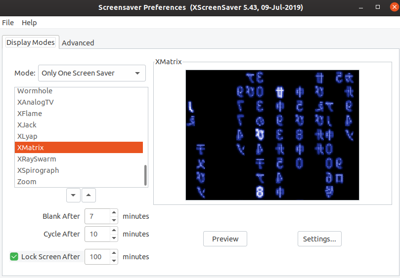
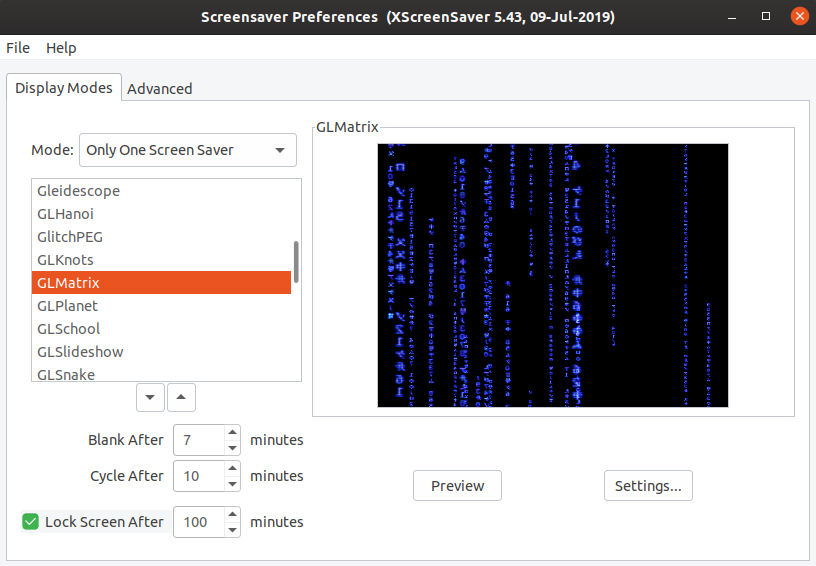

# xscreensaver_BlueMatrix

xscreensaver with Blue XMatrix and GLMatrix Screensavers:
 

 

#### Prepare your system
Uninstall xscreensaver if you have it installed:

    sudo apt remove xscreensaver

Add sourcecode files needed to make the project:
 

    Dash > Software & Updates > Ubuntu Software > Check Source Code Box

Install dependencies needed for compilation:
 

    sudo apt build-dep xscreensaver

#### Compile from Source
 
Download the sourcecode:

    git clone https://github.com/luc1dLife/xscreensaver_BlueMatrix.git

 

    cd to xscreensaver_BlueMatrix\
    ./configure
    sudo make
    sudo make install clean    # disregard any errors
    sudo make install

 

Start xscreensaver:

    Dash > screensaver    # navigate to GLMatrix or XMatrix

 
GLMatrix & XMatrix are now updated with Blue symbols instead of Green. I'm currently unaware of a better blue colored matrix screensaver for linux. 
