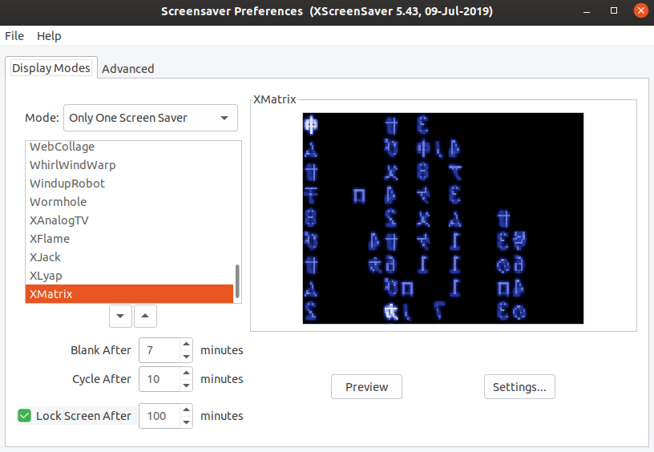

#### xscreensaver_BlueMatrix

xscreensaver with Blue XMatrix and GLMatrix Screensavers:

#### Prepare your system
Uninstall xscreensaver if you have it installed:

    sudo apt remove xscreensaver

Add sourcecode files needed to make the project:

    Dash > Software & Updates > Ubuntu Software > Check Source Code Box

Install dependencies needed for compilation:

    sudo apt build-dep xscreensaver

#### Compile from Source

Download the sourcecode:

    git clone https://github.com/luc1dLife/xscreensaver_BlueMatrix.git

    cd to xscreensaver_BlueMatrix\
    ./configure
    sudo make
    sudo make install clean    # disregard any errors
    sudo make install

Start xscreensaver:

    Dash > screensaver    # navigate to GLMatrix or XMatrix

GLMatrix & XMatrix are now updated with Blue symbols instead of Green. I'm currently unaware of a better blue colored matrix screensaver for linux. 

#### Questions
Contact me at [matt@brassey.io](mailto:matt@brassey.io) with any questions or comments.

#### License
`xscreensaver_BlueMatrix` is published under the __CC0_1.0_Universal__ license.

> The Creative Commons CC0 Public Domain Dedication waives copyright interest in a work you've created and dedicates it to the world-wide public domain. Use CC0 to opt out of copyright entirely and ensure your work has the widest reach. As with the Unlicense and typical software licenses, CC0 disclaims warranties. CC0 is very similar to the Unlicense.